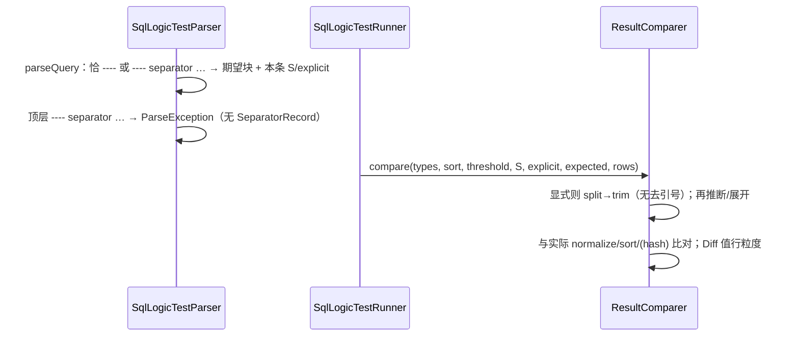

# Design: ggtest-rowwise-expected

> 架构选型与模块边界。行为合同见 [`spec.md`](./spec.md)；实施任务见 [`plan.md`](./plan.md)。
>
> **feature-id / sub-feature-id**：`ggtest-rowwise-expected` / `ggtest-rowwise-expected`（未拆分）
>
> **适用对象**：Planner、Developer、Reviewer。
>
> **前置条件**：Spec **approved**（2026-07-25 OQ-1…OQ-7；2026-07-26 合入前修订 R1/R2/R3，**第四次修订已废止 R3**，保留 R1/R2）；既有分层 `parser` → `model`，`runner` → `normalize`；归档 normalize / cli-report Diff 只读。
>
> **阅读顺序**：背景 → 方案对比与决策 → 模块边界与依赖 → 风险 → Plan/Developer 要点。
>
> **预期结果**：明确期望头解析落点、顶层 `SeparatorRecord` 处置、显式 trim 落点（**无引号层，已废止 R3**）、分层依赖，足以编写可验证 Plan。
>
> **失败处理**：实现偏离本 Design 边界或依赖方向时按 Plan 回改；行为偏差以 Spec 为准，不得用 Design 改写合同。

## 背景

- Spec（R1）：`---- separator <delim>` 写在**本条 query 期望头**上，仅绑定本条；废止文件级、向后至 EOF 的顶层指令主路径。
- Spec（R2）：显式 separator 路径 split → trim → 推断/展开；默认恰 `----` 保持既有空格行式规则。
- Spec（**已废止 R3**）：行式期望**无**单引号语法壳；不处理 `''`；不提供 `splitLiteralRespectingQuotes` / `unquote`（或等价）合同能力。含空格用显式 `S`（如 `|`）+ trim 后**裸文本**，或每值一行；单元格含当前 `S` → 换分隔符或每值一行。
- 现状（合入前已实现、待按修订回改）：顶层 `SeparatorRecord` + `FileState.columnSeparator`；`parseQuery` 仅识别恰 `----`；`ExpectedResultExpander` **已含引号实现**（`splitLiteralRespectingQuotes`、`unquote`、未闭合引号失败路径），须按废止 R3 **删除**。
- 硬约束：不改 I/T/R 单值规范化、不改 MD5 拼接口径、不破坏官方「每值一行」；禁止入库 `.env` / `examples/demo2.slt`；废止 `---separator` 与裸 `separator`。

## 方案对比与决策

### D1 — 期望头解析与本条 `S` 绑定

| 方案 | 概要 | 优点 | 缺点 |
|---|---|---|---|
| A（**选定**） | `parseQuery` 读 SQL 后识别期望头：恰 `----` → 开期望块 + 默认 `S`=U+0020、`explicit=false`；`---- separator <delim>` → 开期望块 + 本条 `S=<delim>`、`explicit=true`；delim/`explicit` 写入 `QueryRecord` | 与 R1 一致；runner 无需文件级 `S`；下一条默认空格自然隔离 | 须扩展 `QueryRecord` 字段；改期望头判定（现仅恰 `----`） |
| B | 继续顶层 `SeparatorRecord` + `FileState` 覆盖，期望头仍仅恰 `----` | 少改现有接线 | **违反 R1**；禁止再选 |

**决策：采用方案 A。**

期望头分流（合同算法，落在 `parseQuery`，非顶层分派）：

1. SQL 体结束后，下一非空行以 `----` 开头则按 Spec「`----` 行解析」。
2. trim 后恰 `----` → 期望块；本条 `S=" "`，`explicitColumnSeparator=false`。
3. `----` + 可选空白 + `separator` +（可选一个前导空白）+ `<delim>` 至行尾 → 期望块；本条 `S=<delim>`，`explicit=true`；空 delim → `ParseException`。
4. 其他以 `----` 开头 → `ParseException`（可读）。
5. 关键字 `separator`；`seperator` 不生效或明确报错。
6. delim：**禁止** `splitTokens` 整取；关键字后至多去一个前导空白，其余至行尾为字面量。

`QueryRecord` 增补（名称可微调，语义冻结）：`columnSeparator: String`（默认 `" "`）、`explicitColumnSeparator: boolean`（默认 `false`）。无期望块时二者取默认（execute-only 不参与展开）。

### D2 — 顶层 `SeparatorRecord`：移除 vs 非法

| 方案 | 概要 | 优点 | 缺点 |
|---|---|---|---|
| A（**选定**） | **移除**顶层文件级指令：删除 `SeparatorRecord` 及 `FileState.columnSeparator`；顶层遇 `---- separator …`（及非法 `----…`）→ 可读 `ParseException`（说明须写在 query 期望头） | 用户可见无文件级覆盖；无僵尸 model；与 R1「废止顶层主路径」一致 | 须改 sealed permits、runner switch、既有「顶层指令」单测/fixtures |
| B | 保留类型，顶层成功解析后 runner 拒绝或解析期一律非法 | 短期少删类型 | 死类型 + 双概念（顶层 record vs 本条字段）；易误用 |

**决策：采用方案 A（最小破坏于合同与架构清晰度）。** 恰为 `----` 顶层仍报「非顶层 record」（既有）；`---- separator …` 顶层改为非法，**不得**再产出可执行 record。

### D3 — normalize：显式路径 trim vs 默认空格路径（**已废止 R3，无引号层**）

| 方案 | 概要 | 优点 | 缺点 |
|---|---|---|---|
| A（**选定**） | 展开在 `ExpectedResultExpander`；入参 `S`+`explicit`。**显式**：不压缩 split → 对每 token trim 两侧空白 → 按 `C` 推断/`SortMode` 展开；trim 后 token **原文**即单元格，**不**去外层 `'`、**不**处理 `''`、**无**未闭合引号分支。**默认**恰 `----`：既有空格规则（连续空格→空 token；**不** trim） | 与 R2 一致；删除引号分支后 split/trim 单一职责；单测可隔离 | 签名增 `explicit`；须删除 `splitLiteralRespectingQuotes` / `unquote` |
| B | 默认与显式一律 trim | 实现简单 | **破坏**默认连续空格→空 token（违反 R2） |
| C | trim 在 parser 写回期望正文 | comparer 无感 | 违反「parser 只产 model」；丢失原始行 |

**决策：采用方案 A。** 显式路径统一走 `splitLiteral`（不压缩连续分隔符）+ token trim，**删除**引号感知 split 与 `unquote`（**已废止 R3**）；期望侧字面 `'…'` 作单元格内容原文（走既有 I/T/R 规范化），不再有语法壳。哈希单行短路径不展开；只改期望→值序列；实际侧不变。空 token/`(empty)`、混用失败按 Spec。

### D4 — `ResultComparer` 入参形态

| 方案 | 概要 | 优点 | 缺点 |
|---|---|---|---|
| A（**选定**） | `compare(..., String columnSeparator, boolean explicitColumnSeparator, ...)`；旧重载默认 `S=" "`且 `explicit=false` | 既有单测少改；语义清晰 | 布尔参数需文档 |
| B | 引入包内 `ColumnSeparatorSpec(literal, explicit)` 值对象 | 避免布尔迷路 | 略增类型；非必须 |

**决策：方案 A**（若实现时局部用包内 record 包装亦可，不对外冻结 API）。无指令≡默认空格且非显式。

## 模块影响

| 模块 | 变更 | 边界 |
|---|---|---|
| `com.ggtest.model` | `QueryRecord` 增 `columnSeparator` + `explicitColumnSeparator`；**删除** `SeparatorRecord`（permits 同步） | 纯数据；无推断 |
| `com.ggtest.parser` | `parseQuery` 期望头分流（D1）；顶层 `----` 族：恰 `----` / `---- separator…` / 非法均不得作成功顶层 record（D2）；更新 `isRecordStart` | 不推断行式；不执行 trim |
| `com.ggtest.normalize` | expander：显式 **仅 trim**（D3）；**删除** `splitLiteralRespectingQuotes` / `unquote` 及未闭合引号分支（已废止 R3）；`compare` 接受 `S`+`explicit`（D4）；Diff 仍对展开后值行 | 不解析文件指令；不持文件级状态；无引号语义 |
| `com.ggtest.runner` | **移除** `FileState` 列分隔符；`runQuery` 从 `QueryRecord` 取 `S`/`explicit` 传入 comparer | 不实现 split/trim/推断 |
| `com.ggtest.cli` | 无行为合同变更 | 不解析期望头 |

### 依赖方向（不变）

```text
parser → model
normalize → model
runner → model, normalize, db
cli → parser, runner, …
parser ↛ normalize；normalize ↛ runner/parser
```

### 数据流（增量）



### parser / `isRecordStart` / 期望块（修订）

| 场景 | 判定 |
|---|---|
| `parseQuery` 内：恰 `----` | 期望块边界；本条默认空格、非显式 |
| `parseQuery` 内：`---- separator …` | 期望块边界；本条 delim、显式 |
| 顶层：恰 `----` 或 `---- separator …` 或其它 `----…` | 解析失败（可读）；**不**产出 `SeparatorRecord` |
| 非 `----` 开头的既有指令 | 不变 |

## 风险

| 风险 | 影响 | 缓解 |
|---|---|---|
| 误推断：每值一行在当前 `S` 下每行 token 数恰 =`C` | 错误走行式 | 默认空格且 `C>1` 时官方每值一行每行 1 token；`C=1` 两形态等价；smoke 回归 |
| 期望头与顶层分流错误 | 错绑 `S` 或静默文件级行为 | 单测：期望头 `|`；下一条恰 `----` 不继承；顶层 `---- separator` 失败；非法 `----…`/空 delim |
| 默认路径误加 trim | P0-1 连续空格语义破坏 | `explicit=false` 分支禁止 trim；单测锁定 |
| 删引号实现漏改（残留 `splitLiteralRespectingQuotes` / `unquote` 或其调用/测试） | 编译残留或行式仍去引号（违反已废止 R3） | 删方法及全部调用点；显式路径单测：`'hello world'` 视为原文含 `'`（P1-4 不因去引号通过）；含 `S` 须换分隔符或每值一行（P0-5）；全量 `mvn test` |
| 删除 `SeparatorRecord` 漏改 switch/测试 | 编译或行为残留文件级 | 全量 `mvn test`；fixtures 去掉文件顶指令 |
| 哈希被 trim 污染算法 | MD5 口径漂移 | 仅影响期望展开后的值；哈希短路径与拼接算法不动 |

## 对 Plan 与 Developer 的要点

- 覆盖 **P0-1…P0-9**；TDD 顺序：期望头解析 → 删 `SeparatorRecord` → expander **删引号**并保留显式 trim → runner 本条接线 → 删依赖引号的 fixtures/测试并改 README/dev-notes；分支 `ggtest-rowwise-expected`；Review **required**（须重新 Approve）。
- **必须**：期望头绑定本条 `S`/`explicit`；显式**仅** trim（**无**去引号）；删除 `splitLiteralRespectingQuotes` / `unquote` 及其调用/测试/fixtures；顶层 `---- separator` 非法且删除类型。**禁止**：改 `ValueNormalizer`/`ResultHasher`；提交 `demo2.slt`/`.env`；fixtures 文件顶全局指令；**新增或保留**行式期望单引号语法壳（含 `rowwise-pipe-separator.test` 须改为无引号裸文本目标书写）。
